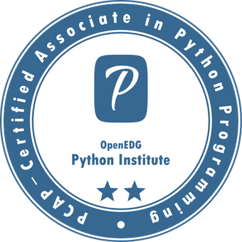
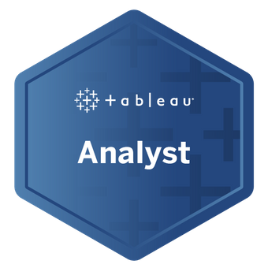

#### Microsoft

|  |  |  |
|:----------------------------------------------------------:|:-------------------------------------------------------:|:------------------------------------------------------:|
| [**Azure Data Scientist Associate**](https://www.microsoft.com/en-us/learning/certification-overview.aspx)   This certification indicates expertise in operationalizing Azure Machine Learning services and running data experiments.   *Date:* October 2021 | [**Azure AI Fundamentals**](https://www.microsoft.com/en-us/learning/certification-overview.aspx)   A foundational knowledge in artificial intelligence concepts related to Azure services.   *Date:* September 2021 | [**Azure Fundamentals**](https://www.microsoft.com/en-us/learning/certification-overview.aspx)   It covers foundational knowledge of cloud services, and how those services are provided with Microsoft Azure.   *Date:* June 2021 |

---

#### OpenEDG Python Institute

|  |
|:---------------------------------------------------:|
| [**PCAP – Certified Associate in Python Programming**](https://pythoninstitute.org/certification/)   This certification validates one's skills in the Python language, ensuring they are familiar with the universal computer programming concepts.   *Date:* August 2021 |

---

#### Tableau

|  |
|:-------------------------------------------------------------------:|
| [**Tableau Analyst**](https://www.tableau.com/learning/certification)   Demonstrates one's knowledge in core Tableau concepts such as core calculations, field types, and design principles.   *Date:* May 2020 |

<!-- 

## Microsoft Certified: Azure AI Fundamentals

- Issuing Organization: Microsoft
- Date: September 2021

---

## PCAP – Certified Associate in Python Programming

- Issuing Organization: OpenEDG Python Institute
- Date: August 2021

---

## Microsoft Certified: Azure Fundamentals

- Issuing Organization: Microsoft
- Date: June 2021

---

<!-- ## Spark and Python for Big data with PySpark

- Issuing Organization: Udemy
- Date: November 2020 -->

---

<!-- ## Databases and SQL for Data Science

- Issuing Organization: Coursera
- Date: May 2020
- Credential ID: TM4FD929LADJ -->

<!-- ---

## Tableau Analyst

- Issuing Organization: Tableau
- Date: May 2020

---

## Microsoft Certified: Azure Data Scientist Associate

- Issuing Organization: Microsoft
- Date: October 2021   --> 